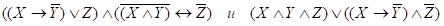
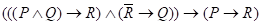
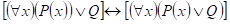

Дискретная математика для программистов
Лабораторная работа № 11 (апрель-2023). Методы логического вывода
Вариант 10
Доказать или опровергнуть методом ИВН и методом резолюций выводимость правой формулы из левой

Доказать методом Хао Вонга и методом резолюций формулу

Доказать формулу, перейдя от предикатов к моделям

Для второго пункта написать программу вывода формулы 
