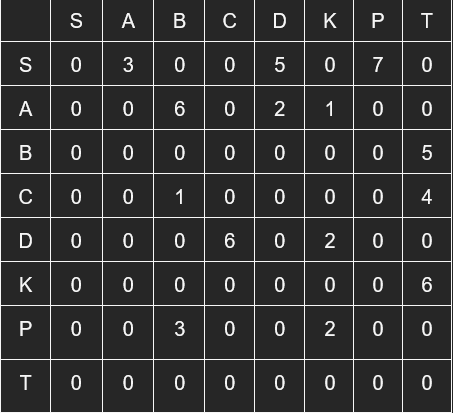

## Лабораторная работа № 8. март-2023.
## Вариант 10

Задание.
Для сети найти максимальный поток из узла S в узел T и соответствующий ему минимальный разрез.
Для этой же сети задать случайные пропускные способности дуг со значениями из промежутка [100, 1000] и также найти максимальный поток и соответствующий ему разрез.
Для этого написать программу реализующую алгоритм поиска максимального потока. 

	S	A	B	C	D	K	P	T
S	0	3	0	0	5	0	7	0
A	0	0	6	0	2	1	0	0
B	0	0	0	0	0	0	0	5
C	0	0	1	0	0	0	0	4
D	0	0	0	6	0	2	0	0
K	0	0	0	0	0	0	0	6
P	0	0	3	0	0	2	0	0
T	0	0	0	0	0	0	0	0
